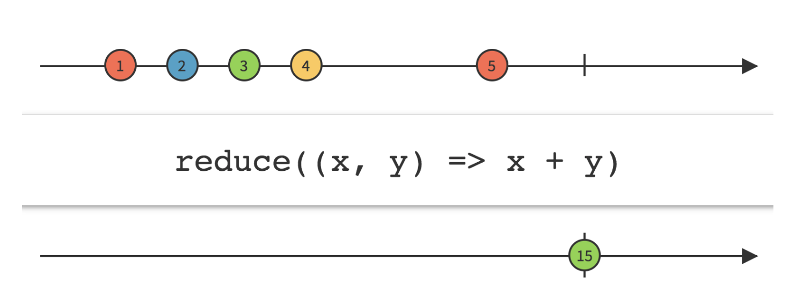

## Rx Marbles

Marble Diagrams are indispensable when it comes to learning Rx.

Below are 3 Marble Diagrams of hypothetical, generic event scenarios that illustrate 3 of the most commonly used Rx __*transforming operators.*__

However, all 3 diagrams are incomplete: They are all missing the timeline showing the event stream resulting from each of their respective operators.

> __*TIP:*__ You should be familiar with how the first 2 operators work; they are very similar to their HoF counterparts found in the standard Swift libraries, except they work with Observable sequence elements.

**TODO:**
- Study each one of the diagrams and the description of each operator.
- Complete the diagram by filling in the resulting event stream for each operator (*see the `filter()` operator diagram above for hints*).

__*Exercise 1:*__ `map()` &mdash; Transforms items emitted by an Observable by applying a function to each item or converting from one item type into another:

<!--

 -->

__*Exercise 2:*__ `reduce()` &mdash; Applies a function to each item emitted by an Observable, sequentially, and emits the final value:

<!-- 
 -->

__*Exercise 3:*__ &mdash; The `distinct()` suppresses duplicate items emitted by an Observable:

 
 <!--  -->

[Jamboard](https://jamboard.google.com/d/1btrusJhzkKNjEhgrB-F6sUvlIQn-4YU8rDQSy4Zjehg/viewer)
